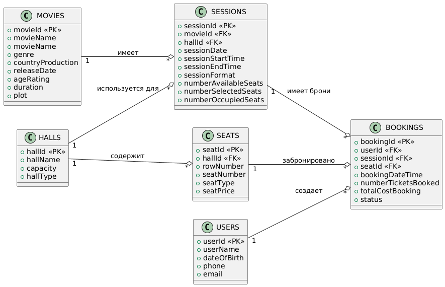

# Спецификация API кинотеатра
## Содержание

- [Спецификация API кинотеатра](#спецификация-api-кинотеатра)
  - [Содержание](#содержание)
  - [Контекст задания](#контекст-задания)
    - [Задание 1](#задание-1)
    - [Задание 2](#задание-2)
    - [Задание 3](#задание-3)
  - [Решение](#решение)
    - [Решение 1](#решение-1)
      - [1. Структура хранения данных](#1-структура-хранения-данных)
      - [2. Взаимодействие с API](#2-взаимодействие-с-api)
      - [3. Действия API](#3-действия-api)
      - [4. HTTP методы API](#4-http-методы-api)
      - [5. Ресурсы API](#5-ресурсы-api)
      - [6. Параметры запросов и ответов для методов HTTP](#6-параметры-запросов-и-ответов-для-методов-http)
    - [ER-диаграмма](#er-диаграмма)
    - [Решение 2, 3](#решение-2-3)

## Контекст задания

Кинотеатр “Искорка” показывает фильмы для детей и подростков. 

Кинотеатр имеет онлайн расписание, а также продает билеты на свои сеансы онлайн через систему бронирования. 

Информация о забронированных билетах вносится в базу бронирования, с указанием данных покупателя.

Все данные о сеансах и бронировании хранятся и обрабатываются на одном сервере.

Требуется автоматизировать решение следующих задач:
* Узнать наличие мест на сеанс
* Забронировать место
* Отменить бронь
* Изменить время сеанса (администратором кинотеатра)

Так как система построена на микросервисной архитектуре - для решения задачи нужно спроектировать API.
### Задание 1
Подготовьте данные для проектирования API, отвечая на вопросы ниже:
1.	Описать структуру хранения данных (по примеру ниже):

|Имя|Тип|Описание поля (для проверяющих)|
|:--|:--|:------------------------------|
|(заполнить)|(заполнить)|(заполнить)|

2.	Кто будет взаимодействовать с API
3.	Какие действия будет выполнять API
4.	Какие HTTP методы будет использовать API
5.	К каким ресурсам будет обращаться API
6.	Какие параметры запроса будут передаваться в каждый из методов?
7.	Какие параметры ответа будут в методах?

### Задание 2

Спроектировать и описать API для решения задач выше. Использовать данные, подготовленные в задании 1. Для подготовки документации использовать нотацию Open API и инструмент https://app.swaggerhub.com/home или https://editor.swagger.io/

Описать разделы:

* Info;
* Servers;
* Paths, включая подразделы Parameters, Responses.

### Задание 3

1. Продумать и реализовать механизм пагинации. Пагинация может быть реализована как с помощью прикладывания ссылки на следующий запрос, так и с помощью счётчика и указания механизма сдвига.
2. Продумать и реализовать ошибочные ответы: как минимум 400, 404, 500.
3. Описать получение ответа как в формате JSON, так и в формате XML. Достаточно использовать автогенерацию Swagger.

## Решение

### Решение 1

#### 1. Структура хранения данных

1.	Информация о бронировании

брони (bookings)

| Имя                  | Тип                                              | Описание поля                        |
|----------------------|--------------------------------------------------|--------------------------------------|
| bookingId            | integer                                          | идентификатор бронирования           |
| userId               | integer                                          | ссылка на идентификатор пользователя |
| sessionId            | integer                                          | ссылка на идентификатор сеанса       |
| seatId               | integer                                          | ссылка на идентификатор места        |
| bookingDateTime      | string (format: Date-Time)                       | дата и время бронирования            |
| numberTicketsBooked  | integer                                          | кол-во забронированных билетов       |
| totalCostBooking     | string (format: Money)                           | общая стоимость бронирования         |
| status               | String: enum (“confirmed”, “canceled”)           | статус                               |

2.	Информация о фильме         

фильмы (movies)         

| Имя                  | Тип                                              | Описание поля                        |
|----------------------|--------------------------------------------------|--------------------------------------|
| movieId              | integer                                          | идентификатор фильма                 |
| movieName            | string                                           | наименование фильма                  |
| genre                | string                                           | жанр                                 |
| countryProduction    | string                                           | страна производства                  |
| releaseDate          | string (format: date)                            | дата выхода                          |
| ageRating            | String: enum (“6+”, “12+”,”16+”, “18+”)          | возрастной рейтинг                   |
| duration             | integer                                          | продолжительность, мин               |
| plot                 | string                                           | сюжет                                |

3.	Информация о сеансе         

cеансы (sessions)         

| Имя                  | Тип                                              | Описание поля                        |
|----------------------|--------------------------------------------------|--------------------------------------|
| sessionId            | integer                                          | идентификатор сеанса                 |
| movieId              | integer                                          | ссылка на идентификатор фильма       |
| hallId               | Integer                                          | ссылка на идентификатор зала         |
| sessionDate          | string (format: date)                            | дата сеанса                          |
| sessionStartTime     | string (format: date-Time)                       | дата и время начала сеанса           |
| sessionEndTime       | string (format: date-Time)                       | дата и время конца сеанса            |
| sessionFormat        | String: enum (“2D”, “3D”)                        | формат сеанса                        |
| numberAvailableSeats | integer                                          | количество свободных мест            |
| numberSelectedSeats  | integer                                          | количество выбранных мест            |
| numberOccupiedSeats  | integer                                          | количество занятых мест              |

4.	Информация о пользователе       

пользователи (users)         

| Имя                  | Тип                                              | Описание поля                        |
|----------------------|--------------------------------------------------|--------------------------------------|
| userId               | integer                                          | идентификатор пользователя           |
| userName             | string (format: Name)                            | ФИО пользователя                     |
| dateOfBirth          | string (format: date)                            | дата рождения                        |
| phone                | string (format: phone)                           | телефон                              |
| email                | string (format: email)                           | email                                |

5.	Информация о зале кинотеатра         

залы (halls)         

| Имя                  | Тип                                              | Описание поля                            |
|----------------------|--------------------------------------------------|------------------------------------------|
| hallId               | integer                                          | идентификатор зала                       |
| hallName             | string                                           | название зала                            |
| capacity             | integer                                          | количество мест                          |
| hallType             | string (enum: IMAX, VIP, Standart)               | тип зала (список: IMAX, VIP, Стандартный)|

6.	Информация о месте в зале кинотеатра

места (seats)

| Имя                  | Тип                                              | Описание поля                                          |
|----------------------|--------------------------------------------------|--------------------------------------------------------|
| seatId               | integer                                          | ссылка на идентификатор меcта                          |
| hallId               | integer                                          | идентификатор зала                                     |
| rowNumber            | integer                                          | номер ряда                                             |
| seatNumber           | integer                                          | номер места                                            |
| seatType             | string, (enum: chair, sofa, disabledPersonChair) | тип места (список: кресло, диван, место для инвалидов) |
| seatPrice            | string (format: Money)                           | стоимость места                                        |

#### 2. Взаимодействие с API

Взаимодействовать с API будут:
* Покупатели (пользователи, клиенты кинотеатра)-просмотр расписания и наличия мест на сеанс, бронирование, отмена брони.
* Администраторы кинотеатра-управление сеансами (изменение времени).

#### 3. Действия API

* получить список сеансов
* проверить доступные места
* забронировать место
* отменить бронь
* изменить время сеанса (администратор)

#### 4. HTTP методы API

* GET-получить список сеансов
* GET-проверить доступные места
* POST-забронировать место
* DELETE-отменить бронь
* PATCH-изменить время сеанса (администратор)

#### 5. Ресурсы API

* GET /sessions
* GET /sessions/{sessionID}/seats
* POST /bookings
* DELETE /bookings/{bookingID}
* PATCH /admin/sessions/{sessionID}

#### 6. Параметры запросов и ответов для методов HTTP

**1. GET /sessions**

| Параметры запроса| Тело запроса     | Параметры ответа (массив)            |
|------------------|------------------|--------------------------------------|
| sessionDate      | -                | sessionID                            |
| sessionFormat    | -                | movieID                              |
| movieName        | -                | hallID                               |
| genre            | -                | sessionDate                          |
| hallType         | -                | sessionStartTime                     |
| hallName         | -                | sessionEndTime                       |
| limit            | -                | sessionFormat                        |
| offset           | -                | numberAvailableSeats                 |
| -                | -                | numberSelectedSeats                  |
| -                | -                | numberOccupiedSeats                  |

**2. GET /sessions/{sessionID}/seats**

| Параметры запроса| Тело запроса     | Параметры ответа                     |
|------------------|------------------|--------------------------------------|
| sessionID        | -                | sessionID                            |
| limit            | -                | movieID                              |
| offset           | -                | hallID                               |
| -                | -                | sessionDate                          |
| -                | -                | sessionStartTime                     |
| -                | -                | sessionEndTime                       |
| -                | -                | sessionFormat                        |
| -                | -                | numberAvailableSeats                 |
| -                | -                | numberSelectedSeats                  |
| -                | -                | numberOccupiedSeats                  |
  
**3. POST /bookings**
   
| Параметры запроса| Тело запроса     | Параметры ответа                     |
|------------------|------------------|--------------------------------------|
| -                | sessionsID       | bookingID                            |
| -                | seatID           | userID                               |
| -                | userID           | sessionID                            |
| -                | -                | seatID                               |
| -                | -                | bookingDateTime                      |
| -                | -                | numberTicketsBooked                  |
| -                | -                | totalCostBooking                     |
| -                | -                | status                               |
  
**4. DELETE /bookings/{bookingID}**

| Параметры запроса| Тело запроса     | Параметры ответа                     |
|------------------|------------------|--------------------------------------|
| bookingID        | -                | status                               |
  
**5. PATCH /admin/sessions/{sessionID}**

| Параметры запроса| Тело запроса     | Параметры ответа                     |
|------------------|------------------|--------------------------------------|
| sessionID        | sessionDate      | sessionID                            |
| -                | sessionStartTime | movieID                              |
| -                | -                | hallID                               |
| -                | -                | sessionDate                          |
| -                | -                | sessionStartTime                     |
| -                | -                | sessionEndTime                       |
| -                | -                | sessionFormat                        |
| -                | -                | numberAvailableSeats                 |
| -                | -                | numberSelectedSeats                  |
| -                | -                | numberOccupiedSeats                  |

### ER-диаграмма

### Решение 2, 3

Спецификация OpenAPI, сформированная при помощи Swagger приведена по ссылке:
[Спецификация OpenAPI](https://github.com/andlargesoda/API_cinema/blob/main/API_cinema_v1.0.1.yml)